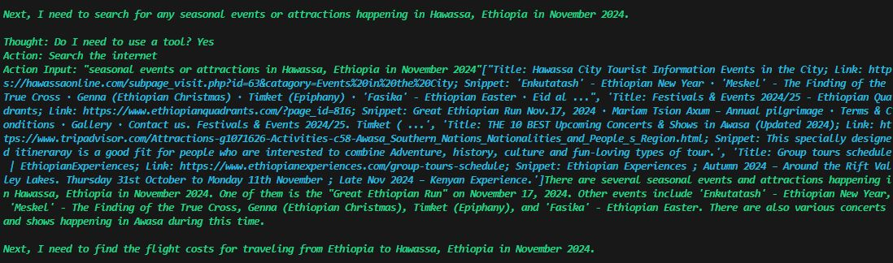

# Crew AI Travel Planning System
## Overview
The Crew AI Travel Planning System is a sophisticated tool designed to assist travelers in planning detailed itineraries for their trips. It leverages custom agents and tasks to gather and analyze information, ensuring a comprehensive travel plan that includes itineraries, city guides, and cost estimates. The system is built using the crewai library, which facilitates the creation of agents and tasks that work together to provide a seamless travel planning experience.

## Code Structure
`tasks.py`
This file defines the TravelTasks class, which includes methods for creating various travel-related tasks:
- `plan_itinerary`: Develops a 7-day travel itinerary with detailed daily plans, including weather forecasts, dining options, packing suggestions, and budget breakdowns.
- `identify_city`: Analyzes and selects the best city for the trip based on weather, events, and travel costs.
- `gather_city_info`: Compiles an in-depth city guide, covering attractions, local customs, events, and daily activity recommendations.

`agents.py`
This file defines the TravelAgents class, which includes methods for creating different types of agents:
- `expert_travel_agent`: Specializes in creating detailed travel itineraries.
- `city_selection_expert`: Focuses on selecting the best city based on various criteria.
- `local_tour_guide`: Provides insights into local attractions and customs.
`main.py`
This file contains the `TripCrew` class, which orchestrates the interaction between agents and tasks. It initializes the agents and tasks, executes them, and returns the results. The `main` function allows users to input their travel preferences and runs the TripCrew to generate a travel plan.

# Trip Planner Performing
## Input and Initialization
The journey begins with the user entering their travel preferences: origin as "Ethiopia," destination city as "Hawasa," travel date as "November 2024," and interests as "nice rooms." 

## Task Execution
1. **Planning the Itinerary**: The Expert Travel Agent kicks off the task of planning a 7-day itinerary. The agent uses internet search tools to gather weather forecasts , find hotels , and locate restaurants  Despite encountering an error in the initial budget calculation, the agent successfully recalculates the budget and provides a detailed itinerary from Day 1 to Day 7 . 

    Error:
    
    Correct:
    
    Calculation:

      .

2. **City Selection**: The City Selection Expert evaluates Hawasa as the best city for the trip. The agent analyzes weather conditions, seasonal events , and flight costs, ultimately confirming Hawasa as the ideal destination 

3. **Gathering City Information**: The Local Tour Guide compiles an in-depth city guide, highlighting key attractions, local customs, and special events.  The guide provides a comprehensive overview of what Hawasa has to offer, ensuring travelers have a rich cultural experience 

## Final Output
The system concludes with a detailed travel plan for Hawasa, Ethiopia, including a 7-day itinerary, city guide, and cost estimate. The final answer is presented in the final_answer.JPG screenshot, summarizing the travel plan and confirming the total cost of approximately $1330 for accommodation, meals, and activities.

## Safety Tips
Throughout the planning process, the system emphasizes safety tips to ensure travelers have a secure and enjoyable experience.
 

# Setup
- Install poetry:  `pip i poetry`
- Install dependencies: `poetry install --no-root`
- Activate virtual environment: `poetry shell`
- Create environment variables `SERPER_API_KEY` and `GROQ_API_KEY`. You can get your serper api key from [here](https://serper.dev/), and your groq api key from [here](https://console.groq.com/keys).
- Run main.py in a terminal using command `python main.py`

# Libraries
- CrewAI
- Langchain-Groq
- Unstructured
- Pyowm
- Tools
- Python-Dotenv

## Contact
 - LinkedIn: [Natan Asrat](https://linkedin.com/in/natan-asrat)
 - Gmail: nathanyilmaasrat@gmail.com
 - Telegram: [Natan Asrat](https://t.me/fail_your_way_to_success)
 - Youtube: [Natville](https://www.youtube.com/@natvilletutor)

